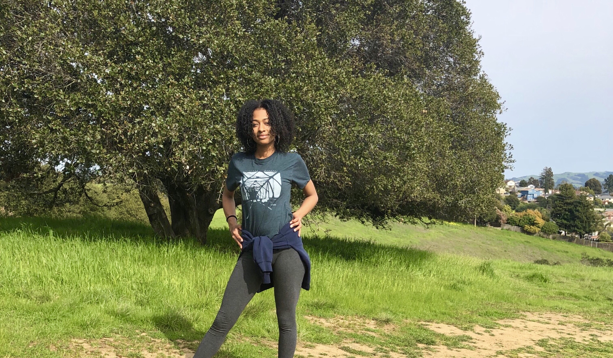
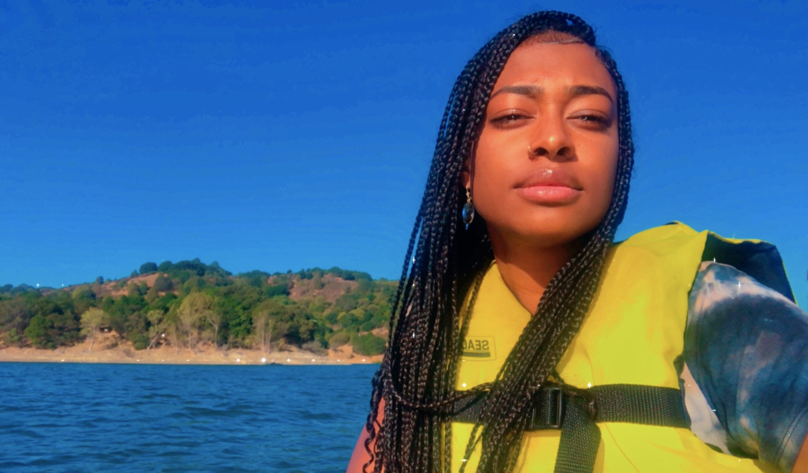
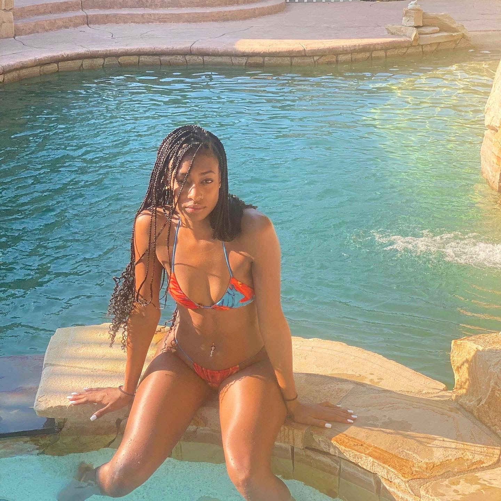

<h1>Afi's Outdoor Experiences!</h1>

<h2>San Pablo Dam Rd</h2>

  <h3>This was a fun hike I took with my partner at the San Pablo Dam Road.
          <br>The hike was 2 miles long each way. We passed a rattle snake and got to the top and saw an amazing view.</br>
  </h3>
  
<hr>

<h2>Mount Diablo, San Ramon Valley</h2>

  <h3>This was another fun hike that my bestfriend Terrence took me to in San Ramon.
         <br>The hike was so short that we made it to the peak within 10 minutes. It wasn't so much of an incline hike, as it was climbing up rocks.    </br>
  </h3>

<hr>
                                                                            
<h2>Kona Hawaii, Kahalu'u Beach</h2>

  <h3>The beautiful view behind me is from one of the Beaches that my friends and I frequented in Hawaii.
         <br>This was the first meeting place that my friends and I had after we all arrived in town. We couldnt contain our joy.</br>
  </h3>

<hr>

<h2>Canoeing in Lake Chabot Regional Park Reservoir</h2>                                    
 
  <h3>This was my most random excursion yet! A long-time friend reached out to me and asked if we could go out in nature. I am always open to doing outdoorsy stuff, and we ended up canoeing across the Lake Chabot Resevior.
  </h3>
                                     
<hr>
                                     
<h2>Pool Party in Walnut Creek!</h2>
                                     
                                    
                                 


                                     
                                     
                                     
                                     

<h3>This was a day in the park at Malia's birthday.<br> I met her mom for the first time and we got drunk with all her friends and family.</h3>
<strong> I wish we could do more days like this</strong>

<hr>

<a href="wwww.Facebook.com">My Favorite Social Media Site!</a> 


  
```
<style>
.handy{color: blue;}
.righteous{color:green;}
</style>

<body>
     <div class="righteous">
          <h1>Sasafrass</h1>
          <p> oenrfironf</p>
     </div>
<div class="handy">
          <h1>Gold</h1>
          <p> Helicopter</p>
     </div>
</body>   
#handy{color:blue
```
